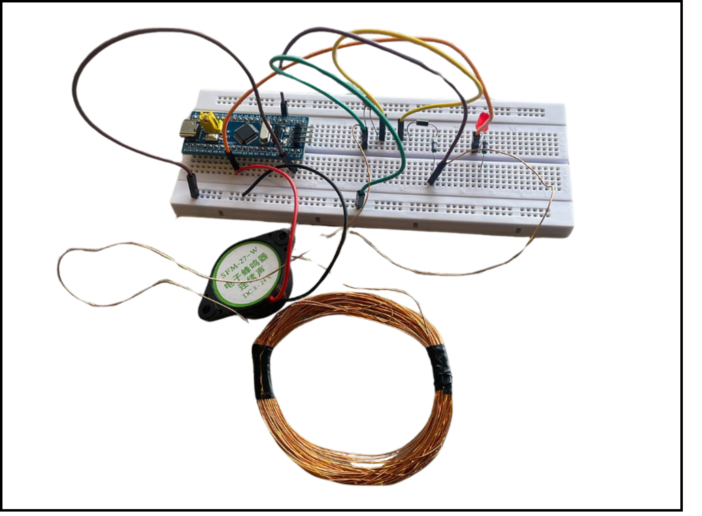
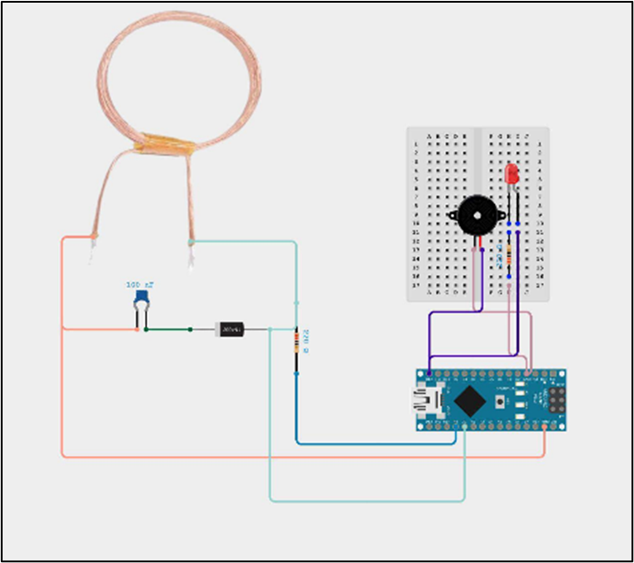
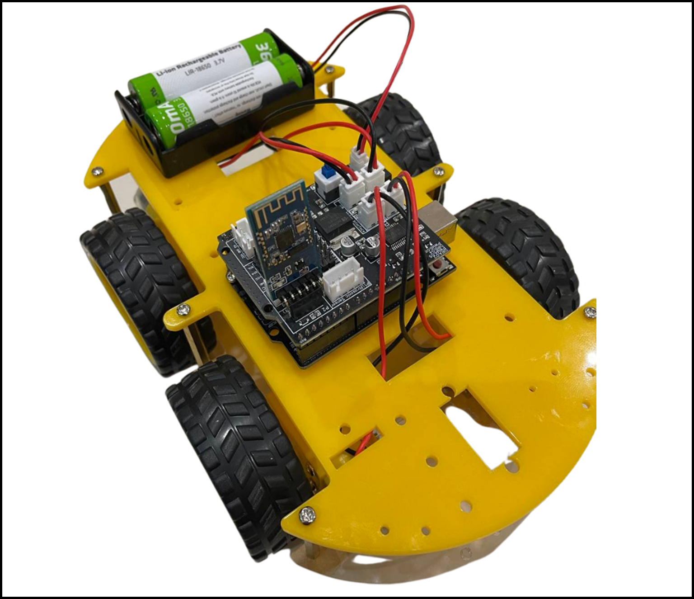
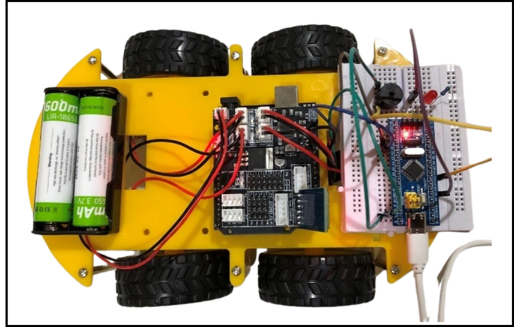

# Wireless Gold Detection Vehicle

A remote-controlled 4WD vehicle equipped with an electromagnetic gold detection circuit, Arduino-based control, and Bluetooth communication — designed for safe mineral exploration in hazardous environments.

---

##  Overview

Traditional gold mining exposes workers to serious health risks, including mercury poisoning and dangerous terrain. This project provides a safer alternative: a wireless vehicle that remotely detects gold using electromagnetic sensing, alerting the operator via buzzer and LED — without any human presence required in the field.

---

## Features

-  **Electromagnetic gold detection** via hand-wound copper coil (pulse-induction method)
-  **Bluetooth remote control** via LightBlue Explorer app (iPhone/iOS)
-  **Buzzer + LED alert** triggered upon detecting conductive metals
-  **4WD mobility** on rough terrain (LAFVIN chassis)
-  **Battery-powered** with rechargeable lithium-ion cells
-  **Dual Arduino system** — Uno for vehicle control, Nano for detection

---

##  Tools & Technologies

| Category | Tool / Component |
|---|---|
| Microcontrollers | Arduino Uno R3, Arduino Nano |
| Wireless | JDY-16 Bluetooth BLE Module |
| Mobile App | LightBlue Explorer (iOS) |
| Detection | Hand-wound Copper Coil, 100nF Capacitor, 1N4007 Diode |
| Vehicle | LAFVIN 4WD Acrylic Chassis |
| Power | Li-Ion 18650 Rechargeable Batteries |
| Programming | Arduino IDE |
| Circuit Design | EasyEDA |

---

##  How It Works

The system uses a **pulse-induction (PI)** detection method:

1. Arduino Nano sends 12 high-speed pulses to charge a capacitor via the copper coil
2. The coil generates an electromagnetic field
3. When a conductive metal (like gold) enters the field, eddy currents alter the discharge rate
4. The Nano measures this change and triggers **buzzer + LED** alerts
5. The operator controls vehicle movement remotely via Bluetooth commands

---

##  Gallery

### 🔌 Circuit Implementation & Diagram

  <table>
    <tr>
      <td align="center"><b>Circuit Implementation</b></td>
      <td align="center"><b>Circuit Diagram</b></td>
    </tr>
    <tr>
      <td></td>
      <td></td>
    </tr>
  </table>

---

###  Vehicle & Results

  <table>
    <tr>
      <td align="center"><b>The Vehicle</b></td>
      <td align="center"><b>Detection Result</b></td>
    </tr>
    <tr>
      <td></td>
      <td></td>
    </tr>
  </table>

---

##  Demo Video

A live demonstration of the vehicle detecting a gold object is available in [`demo/video_result.mp4`](demo/video_result.mp4).

---

##  Documentation

| Document | Description |
|---|---|
| [ Full Report](docs/COE304_Report.pdf) | Complete technical report |
| [ Course Poster](docs/COE304_Poster.pdf) | COE-304  Poster |

---

**Course:** Embedded Systems — COE-304
**Year:** 2024–2025

---

##  License

This work is licensed under **Creative Commons Attribution-NonCommercial-NoDerivatives 4.0 International (CC BY-NC-ND 4.0)**.

© 2025 Sultanah Al Mutairi

